# Node.js App Deployment on AWS EKS with GitOps and Monitoring


## Project Overview

This project demonstrates a full-stack DevOps workflow for deploying a Node.js application using containerization, infrastructure as code, GitOps, and monitoring best practices. The application is containerized with Docker, deployed to an AWS Elastic Kubernetes Service (EKS) cluster with high availability, and continuously deployed using GitHub Actions and ArgoCD. The Kubernetes cluster is monitored using Datadog for performance and reliability.

The key objectives of this project include:  
- Automating infrastructure provisioning with Terraform.  
- Containerizing a Node.js application and deploying it on EKS.  
- Implementing GitOps workflows for CI/CD.  
- Monitoring the cluster and application with Datadog, including dashboards and alerting.

---

## Project Architecture

The architecture is designed for high availability, scalability, and operational efficiency.

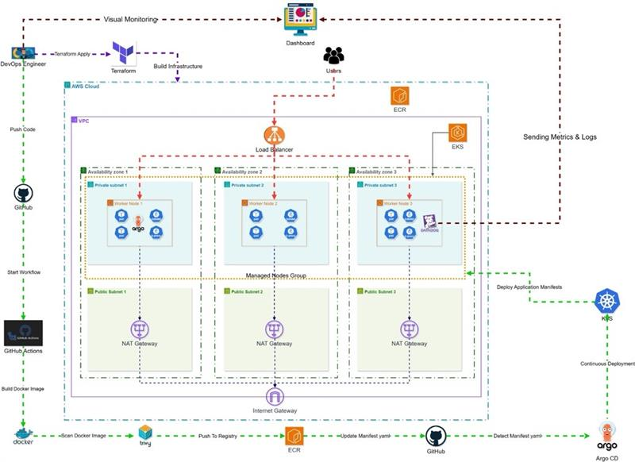

---

## **Core Technologies** 

Terraform, AWS, Docker, Kubernetes, GitHub Actions, ArgoCD, DataDog.

---

## Table of Contents

1. [Infrastructure as Code with Terraform](#infrastructure)
2. [Container Orchestration](#container-orchestration)
3. [CI/CD Pipeline (GitOps)](#cicd-pipeline-gitops)
4. [Monitoring with Datadog](#monitoring-with-datadog)

---

## 1. Infrastructure as Code with Terraform


The underlying cloud infrastructure is provisioned and managed using Terraform, ensuring a repeatable and version-controlled environment. The infrastructure is modularized for maintainability and follows AWS best practices.

### Architecture Overview

The Terraform configuration creates a complete VPC networking foundation with both public and private subnets across multiple Availability Zones, an Amazon EKS cluster with managed node groups, and supporting services including ECR for container storage and AWS Load Balancer Controller for Kubernetes ingress management.

### Provisioned Resources

#### **Networking & VPC**
- **VPC**: `10.0.0.0/16` CIDR block with DNS hostname and DNS support enabled
- **Subnets**: 
  - **Public Subnets**: One in each AZ (`us-east-1a`, `us-east-1b`, `us-east-1c`) with internet routing via Internet Gateway
  - **Private Subnets**: One in each AZ (`us-east-1a`, `us-east-1b`, `us-east-1c`) for worker nodes with outbound internet via NAT Gateways
- **NAT Gateways**: One in each AZ for private subnet internet egress with associated Elastic IPs
- **Route Tables**: Separate routing for public and private subnets
- **VPC Endpoints** (when enabled): Secure private connectivity to AWS services:
  - `ec2`, `elb`, `s3` (Gateway), `ecr.dkr`, `ecr.api`, `eks`, `sts`, `logs`

#### **EKS Cluster (`eks-module/eks.tf`)**
- **Kubernetes Version**: `1.33`
- **Cluster Logging**: Enabled for API, audit, authenticator, controller manager, and scheduler
- **API Server Access**: Both public and private access enabled
- **Network Configuration**: Spanning both public and private subnets

#### **Node Groups (`eks-module/node-group.tf`)**
- **Node Group**: 3 worker nodes for high availability
- **Instance Type**: `t3.medium` instances
- **Scaling Configuration**:
  - **Desired Size**: 2 nodes
  - **Minimum Size**: 1 node  
  - **Maximum Size**: 3 nodes
- **Storage**: 20GB disk per node
- **AMI Type**: Amazon Linux 2023 x86_64 Standard
- **Capacity Type**: On-Demand instances

#### **ECR Repository**
- **Features**:
  - Image tag mutability enabled
  - Automated image scanning on push
  - AES256 encryption
  - Lifecycle policy retaining last 30 images
- **Access Control**: IAM policies for EKS node group and GitHub Actions OIDC integration

#### **AWS Load Balancer Ingress Controller**
- **Helm Release**: `aws-load-balancer-controller` in `kube-system` namespace
- **Version**: `1.7.2`
- **IAM Integration**: Service account with required permissions for ALB provisioning
- **Function**: Manages Application Load Balancers for Kubernetes Ingress resources

#### **IAM & Security**
- **EKS Cluster Role**: With `AmazonEKSClusterPolicy` attachment
- **Node Group Role**: With `AmazonEKSWorkerNodePolicy`, `AmazonEKS_CNI_Policy`, and `AmazonEC2ContainerRegistryReadOnly` attachments
- **GitHub Actions OIDC**: Federated identity for secure CI/CD pipeline access to ECR
- **Load Balancer Controller Role**: IAM role for service account (IRSA) pattern

## Step-by-Step Deployment Guide

Follow these steps to deploy the complete infrastructure:

#### **Step 1: Initialize Terraform**
```
cd terraform/
terraform init
```
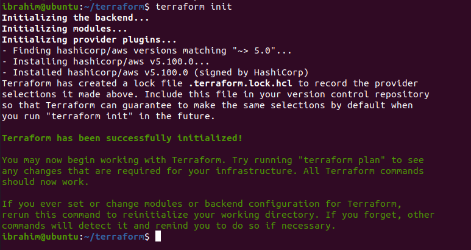

#### **Step 2: Review Execution Plan**
```
terraform plan
```

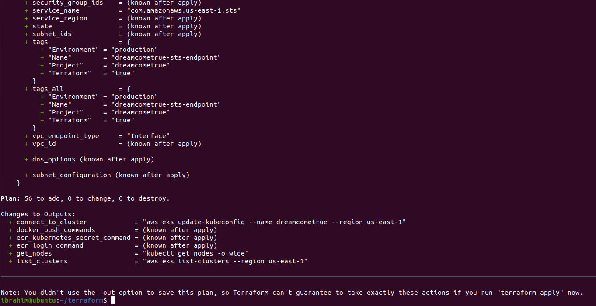

#### **Step 3: Deploy Infrastructure**
```
terraform apply
```
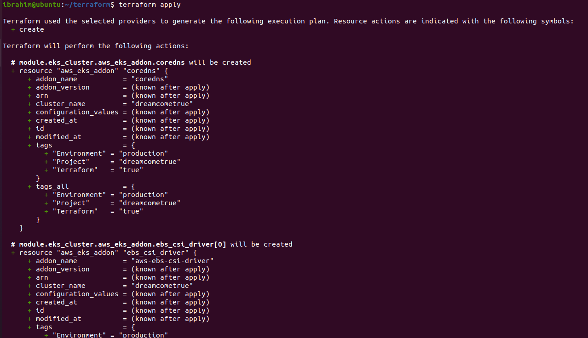


#### **Step 4: Configure kubectl Access to EKS Cluster**
```
aws eks update-kubeconfig --name dreamcometrue --region us-east-1
```
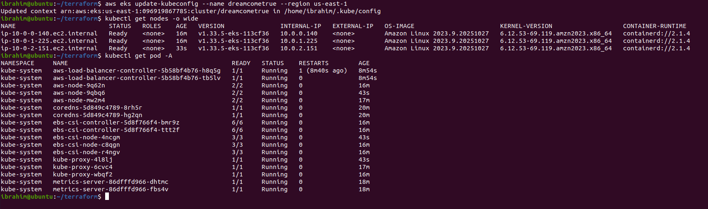

#### **Step 5: Connect to ECR repo**
```
aws ecr get-login-password --region us-east-1 | docker login --username AWS --password-stdin $(terraform output -raw ecr_repository_url)
```
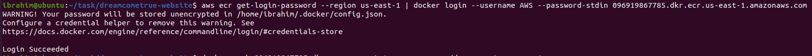


## Verification & AWS Console Validation

After completing the Terraform deployment, verify all resources are properly created in the AWS Management Console.

#### **Step 6: Verify VPC Networking**

1. **Navigate to VPC Console**: Go to AWS Console → VPC → Your VPCs
2. **Locate Your VPC**: Look for `dreamcometrue-vpc` with CIDR `10.0.0.0/16`

**Expected**: VPC should show "Available" status with correct CIDR block.

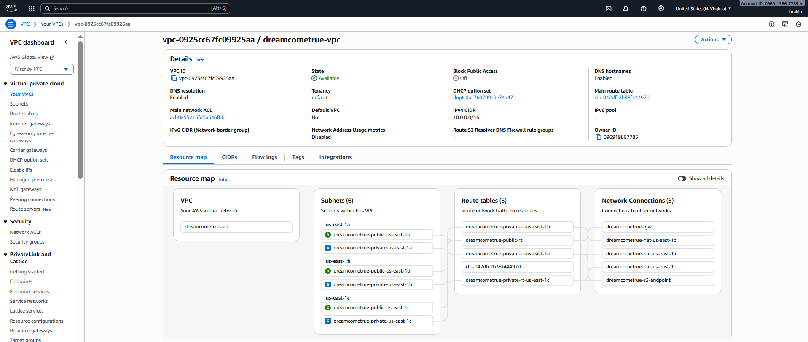


#### **Step 7: Verify EKS Cluster**

1. **Navigate to EKS Console**: Go to AWS Console → EKS → Clusters
2. **Locate Your Cluster**: Click on `dreamcometrue` cluster
3. 3. **Check Compute Tab**: Verify node group configuration

**Expected**:
- **Status**: "Active"
- **Kubernetes version**: "1.33"
- **API server endpoint**: Should show both public and private access
- **Cluster health**: All components should be green
- **Node group name**: `dreamcometrue-nodegroup`
- **Status**: "Active"
- **Instance type**: `t3.medium`
- **Desired capacity**: 2 nodes
- **Node status**: All nodes should be "Healthy"

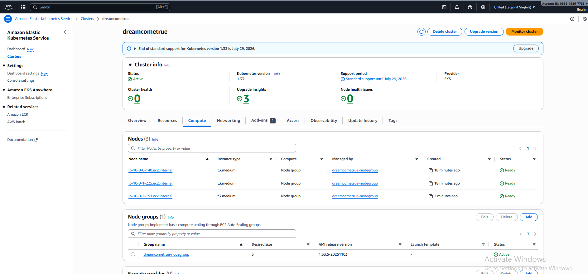

#### **Step 8: Verify ECR Repository**

1. **Navigate to ECR Console**: Go to AWS Console → ECR → Repositories
2. **Locate Your Repository**: Click on `dreamcometrue-repo`

**Expected**:
- **Repository URI**: Should match Terraform output
- **Image tag mutability**: "Mutable"
- **Scan on push**: "Enabled"
- **Encryption**: "AES256"


---

## 2. Container Orchestration

The Node.js application is deployed on Kubernetes with the following configuration:  

- **Deployment:**  
  - 2 replicas for high availability.  
  - Rolling updates configured to minimize downtime during deployment.  

- **Service:**  
  - Kubernetes Service of type `ClusterIP` or `LoadBalancer` to expose the application.
 
- **Ingress:**  
  - Provides a stable URL to access the web application.  
  - Routes traffic to the Node.js service, with optional TLS support.

- **Horizontal Pod Autoscaler (HPA):**  
  - Automatically scales pods based on **memory utilization**.  
  - Threshold configured at **70% memory usage** to maintain performance under load.  

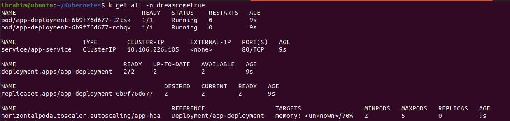


- **Application Access:**  
  - The application is accessible via AWS Application Load Balancer (ALB) provisioned by the Ingress Controller
  - Provides a public URL to access the deployed web application
    
- **Get Application URL**
```
kubectl get ingress -n dreamcometrue
```

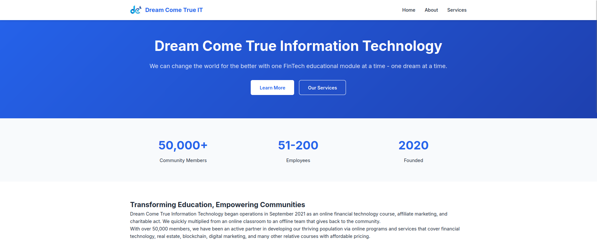

---

## 3. CI/CD Pipeline (GitOps)

### **GitOps Workflow:**  

##### GitOps is a paradigm where Git repositories serve as the single source of truth for declarative infrastructure and application configurations. Changes to Git automatically drive updates to the environment via automation tools like ArgoCD. This ensures consistency, auditability, and easy rollbacks.

**Continuous Integration (CI) with GitHub Actions:**  
- Runs unit tests and linting checks.  
- Builds the Docker image of the Node.js application.  
- Pushes the Docker image to AWS ECR upon successful validation.  

**Continuous Deployment (CD) with ArgoCD:**  
- Watches Git repositories for Kubernetes manifests.  
- Applies changes automatically to the EKS cluster.  
- Ensures application deployments are consistent with Git state.  
- Supports rollback in case of failures.

This project follows a **two-repository pattern** for clear separation of concerns:

1. **Source Code Repository** (For Developers):
   - Contains application source code, Dockerfile, and tests
   - Developers push code changes here

2. **Kubernetes Manifests Repository** (For DevOps):
   - Contains Kubernetes YAML files (deployment, service, HPA, ingress)
   - Automated CI updates manifests here, ArgoCD syncs from here


### Step-by-Step CI/CD Setup

#### **Step 1: Create Required GitHub Secrets**

Navigate to your source code repository → Settings → Secrets and variables → Actions → New repository secret:

Add the following secrets:
- `AWS_ACCOUNT_ID`: Your AWS account ID
- `AWS_REGION`: `us-east-1`
- `GITHUB_TOKEN`: Your GitHub Personal Access Token (with repo permissions)

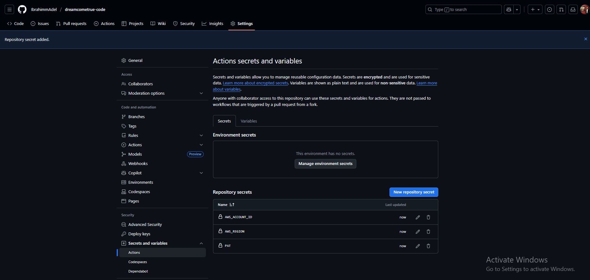

#### **Step 2: Set Up GitHub Actions CI Pipeline**

The CI pipeline is automatically triggered when you push the workflow file. Review the CI/CD configuration:

**[View CI/CD Workflow](ci-cd.yml)**

Key stages of the CI pipeline:
1. **Code Checkout**: Pulls the latest source code
2. **Test**: Runs tests 
3. **Docker Build**: Builds the application container image
4. **ECR Push**: Pushes the image to AWS ECR
5. **Manifest Update**: Updates Kubernetes manifests in the k8s repository

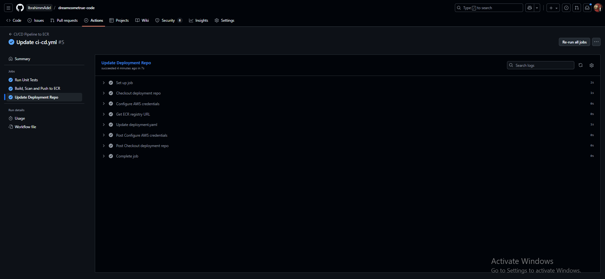

#### **Step 3: Deploy ArgoCD in Your Cluster**

```
kubectl create namespace argocd

kubectl apply -n argocd -f https://raw.githubusercontent.com/argoproj/argo-cd/stable/manifests/install.yaml
```

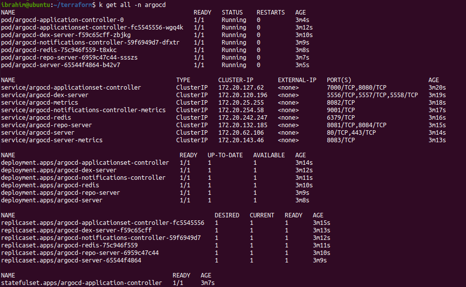

#### **Step 4: Access ArgoCD UI**
```
# Get ArgoCD admin password
kubectl -n argocd get secret argocd-initial-admin-secret -o jsonpath="{.data.password}" | base64 -d

# Port-forward to access ArgoCD UI
kubectl port-forward svc/argocd-server -n argocd 8085:443
```

Access ArgoCD at: https://localhost:8085

- Username: admin
- Password: Use the password from the command above


#### **Step 5: Add Kubernetes Manifests Repository to ArgoCD**

ArgoCD UI → Go to Settings → Repositories → Click Connect Rep

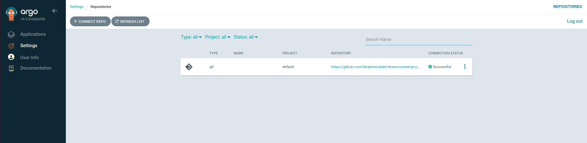


#### **Step 6: Create ArgoCD Application**

ArgoCD UI → New App

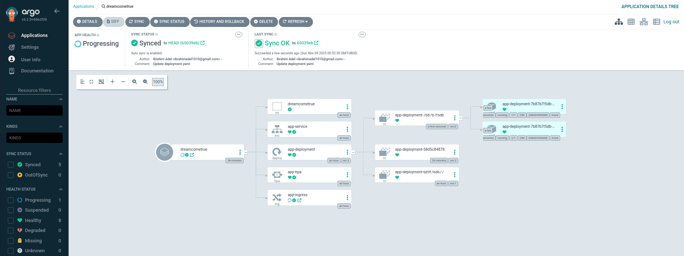


## Pipeline Flow

1. Developer pushes code to dreamcometrue-code repository
2. GitHub Actions triggers CI pipeline:
3. Builds and tests application
4. Builds Docker image
5. Pushes to ECR
6. Updates image tag in dreamcometrue-k8s repository
7. ArgoCD detects changes in dreamcometrue-k8s repository
8. ArgoCD automatically deploys new version to EKS cluster
9. Application is updated with zero downtime (rolling updates)

---

## 4. Monitoring with Datadog

The Kubernetes cluster and Node.js application are monitored with Datadog:  

## Step-by-Step Deployment Guide

Follow these steps to deploy DataDog into your cluster:

#### **Step 1: Add DataDog Helm Repository**
```
helm repo add datadog https://helm.datadoghq.com
helm repo update
```

#### **Step 2: Create DataDog Namespace**
```
kubectl create namespace datadog
```

#### **Step 3: Create DataDog API and App Keys**

Navigate to DataDog Console: Go to DataDog Organization Settings

Create API Key: Organization Settings → API Keys → New Key

Copy the generated API key

Create Application Key: Organization Settings → Application Keys → New Key

Copy the generated App key


#### **Step 4: Create Kubernetes Secret for DataDog Keys**
```
kubectl create secret generic datadog-secret \
  --from-literal api-key='<YOUR_DATADOG_API_KEY>' \
  --from-literal app-key='<YOUR_DATADOG_APP_KEY>' \
  -n datadog
```

#### **Step 5: Review DataDog Helm Values Configuration**

The DataDog Agent is configured using a custom values file. Review the configuration:

**[View datadog-values.yaml](./DataDog/datadog-values.yaml)**


#### **Step 6: Install DataDog Agent with Helm**
```
helm install datadog datadog/datadog -f monitoring/datadog-values.yaml -n datadog
```

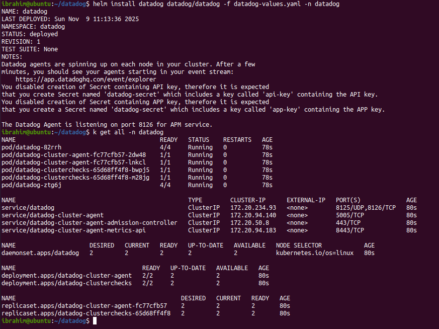


## **Dashboards:**
  - General Cluster Dashboard
  - Visualize CPU and memory of nodes and pods
    
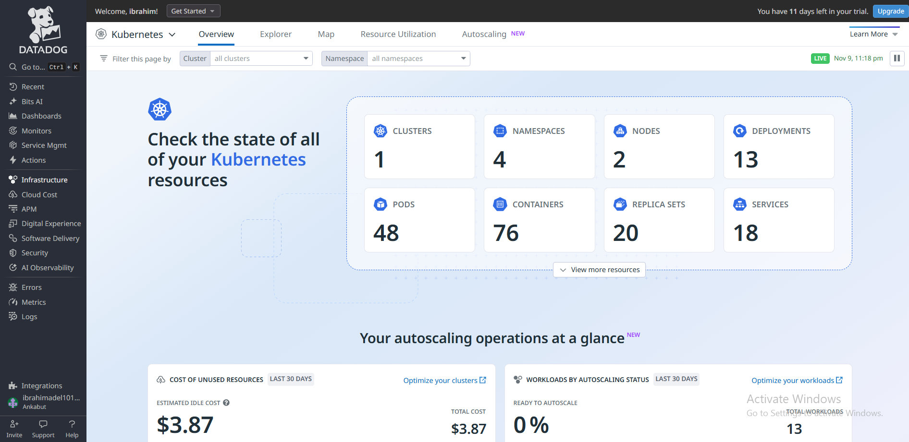
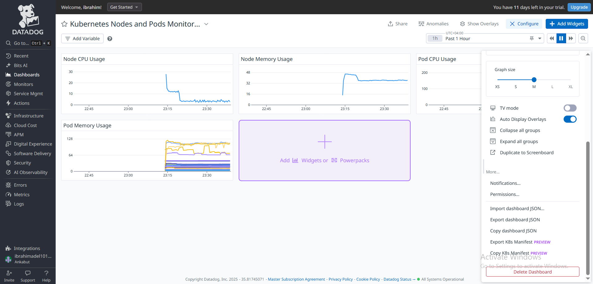


## **Alerts:**  
  - Resource thresholds (CPU > 70%).  
  - Custom alerts via email notifications for critical events.

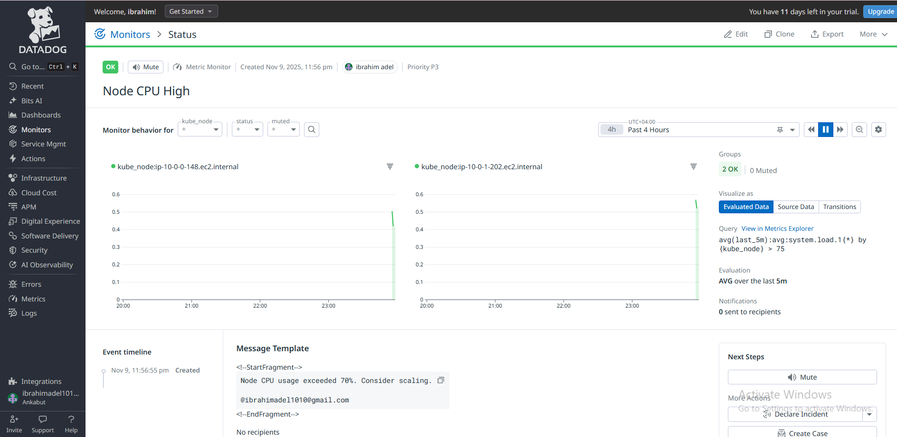

Datadog integration ensures proactive monitoring and operational visibility across the cluster, enabling quick response to issues and maintaining SLA.

---


